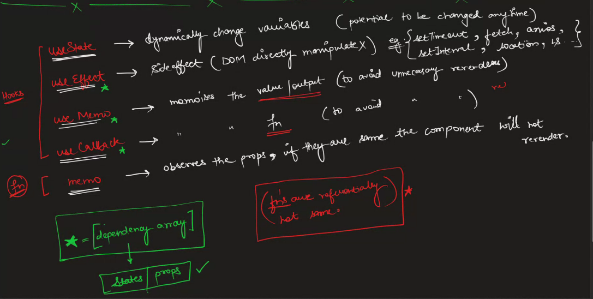

# REvision

* ## useState()

  * dynamically changes variable

* ## useEffect()

  * useEffect(callback,depedency array) and props and states will come in depedency array.
  * does not do any changes in dom , api call (fetch,axios, localstorage ,session),setTiem, interval etc.

* ## Memo

  * memo observes the prop if they are same then component will not re-render

* ## useMemo

  * that memoizes the value or output to avoid un-necessary re-renders

* ## useCallback

  * it re-members the reference (array,function, obj)
  * `function,array,obj are passed by reference so two function reference can never be same despite the fact that both are same`
  * it memoizes the function to avoid the un-necessary re-render.

* 
